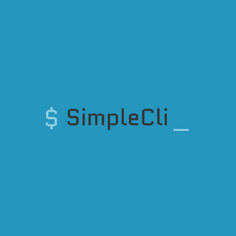

<div align="center">



<h1> SimpleCli </h1>

<h2>A configurable, YAML-driven, command runner CLI</h2>

Define repeatable command workflows with parameter substitution and run them in your terminal.


</div>

CLIs are powerful, but remembering commands, flags, and argument values is not.

_SimpleCli_ lets you save and reuse them in a straightforward YAML file, keeping your workflows consistent and
repeatable.

Key capabilities:

- Command catalogues defined in YAML
- Interactive mode with a simple menu and parameter prompts
- Flexible templating for parameter substitution and command composition
- Works with your existing tools (az, kubectl, jq, etc.) by orchestrating the shell commands you already use

---

# Terminology

SimpleCli uses common command-line interface (CLI) conventions. To avoid confusion, the following terms are used
consistently:

- **Argument** — A positional value supplied to a command. Arguments do *not* start with `-` or `--`.
- **Option** — A named input beginning with `-` or `--` (e.g., `-i`, `--group`). Options may accept a value or may act
  as a boolean switch.
- **Flag** — A boolean option that is either present or absent (e.g., `-i` for interactive mode).
- **Parameter** — A value used for substitution inside `exec` commands. Parameters may come from the command line,
  prompts, or the `scli.params.yaml` file.

Consider the following `ls` command:

```bash
ls -l --color=auto /home/user
```

Breakdown:

- `ls` — command / program name
- `-l` — flag, boolean switch
- `--color=auto` — option with a parameter (value)
- `/home/user` — positional argument (operand)

---

# Quick Start

## Basic Usage

Ensure you have:

- A working shell environment with any tools your commands will call (e.g., Azure CLI `az`, `kubectl`, `jq`).
- A `scli.commands.yaml` file in your working directory with commands listed as follows (see below for more examples):

```yaml
- name: basic
  exec: echo "Hello, world!"
```

To Run a command directly simply use its full path from the `scli.commands.yaml` file, for example, `scli basic`.

> [!TIP]
> If a parameter includes spaces or special characters, wrap it in quotes.

## Interactive Mode

To run in interactive mode, use the `-i` flag: `scli -i`. This will present an interactive menu of categories,
subcategories, and commands which you can navigate through and select a command. If the command requires parameter
values, it will prompt for them.

---

# Commands and Parameter Files

_SimpleCli_ utilises two files:

- `scli.commands.yaml` command definition file
- `scli.params.yaml` parameter values for substitution [**Optional**]

These files can be stored in a number of locations, as listed in order of search preference:

1. Directory specified by the `SIMPLE_CLI_DIR` environment variable.
2. SimpleCli directory in the user home directory i.e. `$HOME/SimpleCli`
3. Current working directory.

## The `scli.commands.yaml` file

Your catalogue of commands is defined in this YAML file. The basic structure is to list commands as follows:

```yaml
- name: basic
  description: Create a command and call it from the CLI e.g. `olcs demo.basic`
  exec: echo "Hello, world!"
```

Where the available command fields are:

- `name`: The CLI name for the command.
- `description`: What the command does (shown in interactive mode).
- `exec`: The shell command to run.

For better organisation, categories and subcategories can also be used:

```yaml
- category: Demo
  commands:
    - name: Basic
      exec: echo "Hello, world!"
  subcategories:
    - name: Subcategory
      commands:
        - name: Basic
          exec: echo "Hello from the subcategory!"
```

These commands can be invoked from the CLI as `scli demo.basic` and `scli demo.subcategory.basic`, respectively.

The example `scli.commands.yaml` file included with this project and
the [Parameter Substitution](#parameter-substitution) section provide further examples of the usage including parameter
substitution and composition.

## The `scli.params.yaml` file

If the values for parameters are known in advance, they can be defined in the `scli.params.yaml` file to enable
automated parameter substitution (see [Substitution from the Params File](#substitution-from-the-params-file)).

The file format is as follows:

```yaml
defaults:
  group: group_a
groups:
  group_a:
    name: Dave
  group_b:
    name: Alice
```

- The defaults section defines the default group to use when no group has been explicitly set.
- The groups section defines sets of parameters grouped by context. Each group contains a set of parameter values that can be used in commands. This allows the same parameter to have different values in different contexts, such as different users or environments.

[!IMPORTANT]
Only one group can be active at a time and is selected using the -s flag.

---

# Parameter Substitution

Parameter substitution allows you to parameterise commands with values from a file or the CLI. To enable parameter
substitution, wrap the value to be substituted in double curly braces, for example: `{{ myvalue }}`.

```yaml
- category: Demo
  commands:
    - name: substitution
      exec: echo "Hello, my name is {{ name }}
```

Now, when running the command, a value can be provided for the parameter `name` **however**, the behaviour is slightly
different depending on whether the command is invoked in interactive mode or not.

In non-interactive mode, the value **must be provided** on the command line using an option: for example,
`scli demo.substitution -p name=Dave`, except for parameters marked optional or with default values.

In interactive mode, the value will be prompted for and a user will be asked to provide a value.

## Customising Parameter Prompts

```yaml
- category: Demo
  commands:
    - name: CustomPrompt
      exec: echo "Hello, my name is {{ name }}
      args:
        - name: name
          prompt: Enter your name
```

When the CLI prompts for a parameter value, it will use the `prompt` field to instruct the user what to enter.

## Substitution from the Params File

```yaml
# scli.commands.yaml
- category: Demo
  commands:
    - name: ParamsSubstitution
      exec: echo "Hello, my name is {{ params.name }}
```

```yaml
# scli.params.yaml
groups:
  A:
    name: Dave
  B:
    name: Alice
```

Instead of providing a value on the command line, you can also provide a value in the `scli.params.yaml` file. To do
this, prefix the parameter name with `params.` e.g. `params.name`. Now, running this command will cause the value to be
substituted from the `scli.params.yaml` file, specifically the active group's `name` parameter.

Changing the active group (`scli -s`) in the params file will cause the command to run with the new value.

## Optional Parameters

```yaml
- category: Demo
  commands:
    - name: Args
      exec: >
        echo "Hello, my name is {{ name }}
         and I live in {{ country }}
      args:
        - name: name
          prompt: Enter your name
        - name: country
          prompt: Enter your country of origin (optional)
          optional: true
```

Parameters can be marked as optional by setting the `optional` field to `true`. This will cause the parameter to be
skipped if not provided.

## Default Values

```yaml
- category: Demo
  commands:
    - name: DefaultValue
      exec: echo "Hello, my name is {{ name }}
      args:
        - name: name
          prompt: Enter your name
          default: Dave
```

To provide a default value, specify it in the `default` field. Now if the user does not provide a value for
the parameter `name`, the default value will be used.

---

# Installation

Build from source:

1. Install Rust (stable) and Cargo.
2. From the project root:
    - `cargo build --release`
3. The compiled binary will be in `target/release/scli`. Put it on your PATH or run it directly:
    - `./target/release/scli -i`

## Dependencies

Your `exec` entries can call any tool available in your shell. For common examples:

- Azure: `az login`, `az account set`, `az keyvault ...`
- Kubernetes: `kubectl`, including contexts, namespaces, pods, logs, scaling, and secrets
- JSON viewing: `jq` (e.g., when parsing logs)

Ensure these tools are installed and on your PATH when running commands that reference them.

## Customising the CLI name

By default, the cli binary is named `scli` however, you can call the CLI whatever you want by setting the binary’s name
in the `Cargo.toml` file and rebuilding:

```toml
[[bin]]
name = "scli"
```

Or alternatively, by creating a wrapper function in your shells `~/.bashrc`, `~/.zshrc`, or `~/.profile`:

```bash
mycli() {
    scli "$@"
}
```

---

# Tips and Troubleshooting

- Quoting matters:
    - When passing option values containing spaces or special characters, wrap them in quotes: `namespace="my ns"`.
- YAML hygiene:
    - Keep indentation consistent. Comments or stray tabs can break parsing.
- Command not found:
    - If a command in `exec` fails with “not found”, install the tool or add it to your PATH.
- Test directly, then codify:
    - First run a command in your shell, then copy it into `exec` and parameterise with `{{ ... }}`.
- Start interactive:
    - If you’re unsure about argument names or defaults, try `scli -i`.

---

# Some _Hidden_ Features

_SimpleCli_ started out as a personal project for use in a DevOps working with Azure. Here are some features that I
added
that may be useful to others.

> [!CAUTION]
> These features may be removed or changed in future releases.

## Kubectl Namespace Selection

For interactive selection of the namespace, including setting a specific namespace with `-n` or specifying all
namespaces
via `--all-namespaces`, use the interactive parameter filter `{{ "namespace" | i_param }}`.
This will list all namespaces and will prompt the user to select one an option. For example:

```yaml
exec: kubectl get pods {{ "namespace" | i_param }} # note that the namespace flag '-n' is omitted
```

## Pre-Commands

```yaml
- category: Demo
  commands:
    - name: ListFlavours
      exec: printf "Vanilla, Strawberry, Chocolate\n" | tr "," "\n"
    - name: SelectFlavour
      pre_command: demo.listflavours
      exec: echo "A {{ flavour }} milkshake, coming right up!"
      args:
        - name: flavour
          prompt: Which flavour do you want?
```

Optionally, run another defined command before this one. This, for example, could be to provide a reminder of possible
values.

---

# Contributing

- Propose improvements to `commands.yaml` structure, naming, and descriptions to keep the catalogue consistent and
  discoverable.
- Prefer small, composable commands connected with `pre_command` over large, opaque scripts.
- Add clear prompts and defaults to improve interactive UX.

# Future Plans:

- Add support for parameter value prompt options, i.e. a list of options to choose from for a parameter.
    - Support command execution or script execution for argument values.
- Retrieve values from local secure storage, e.g. `{{"mysecret" | secret}}`
- Semi-interactive mode for parameter substitution when running a command non-interactively.
- Plugin architecture for adding tool-specific workflows,
  e.g. [kubectl namespace selection](#kubectl-namespace-selection) 